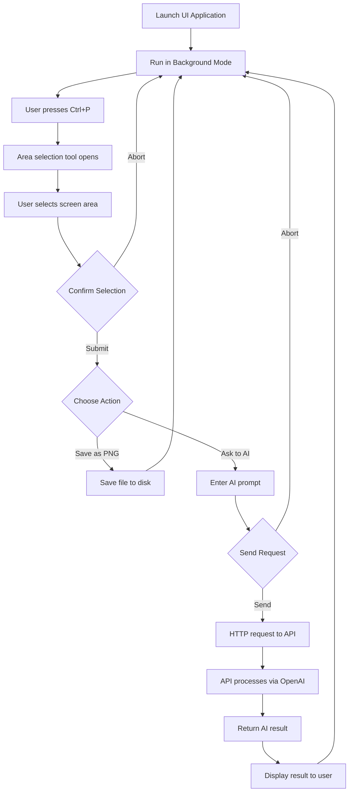

# ScreenshotAI - Screenshot Application with AI Analysis

## Overview

ScreenshotAI is a cross-platform application consisting of two components that allows you to take screenshots of selected screen areas and analyze them using artificial intelligence.

## Application Architecture

### 1. ScreenshotAI.UI (.NET 9 + Avalonia)

User interface application running in background mode and handling screenshots.

**Key Features:**

-   Runs in background mode after startup
-   Activation via global hotkey (default Ctrl+P)
-   Screen area selection for screenshots
-   Save screenshots in PNG format
-   Send screenshots with prompts for AI analysis
-   Display notifications (Toast) to user

### 2. ScreenshotAI.API (.NET 9 WebAPI)

Backend service for processing AI requests.

**Key Features:**

-   HTTP API for receiving screenshots and prompts
-   OpenAI integration via LangChain for .NET
-   Image and text request processing
-   Return AI analysis results

## Workflow



## Installation and Setup

### Requirements

-   .NET 9 Runtime
-   Windows 10+ or Ubuntu 18.04+
-   OpenAI API access (API key required)

### UI Application (ScreenshotAI.UI)

1. Copy `config.json` file to the executable directory
2. Configure settings in `config.json`:
    ```json
    {
    	"HotKey": "Ctrl+P",
    	"ApiUrl": "http://localhost:5000",
    	"SaveDirectory": "./screenshots",
    	"ImageFormat": "PNG",
    	"ToastDisplayTime": 3000,
    	"ToastPosition": "TopRight"
    }
    ```

### API Application (ScreenshotAI.API)

1. Create `.env` file in the application root folder:

    ```
    OPENAI_API_KEY=your_openai_api_key_here
    ```

2. Start the API service:
    ```bash
    dotnet run --project ScreenshotAI.API
    ```

## Configuration

### UI Application (config.json)

| Parameter          | Description                    | Default                   |
| ------------------ | ------------------------------ | ------------------------- |
| `HotKey`           | Global hotkey for activation   | `"Ctrl+P"`                |
| `ApiUrl`           | API service URL                | `"http://localhost:5000"` |
| `SaveDirectory`    | Screenshot save directory      | `"./screenshots"`         |
| `ImageFormat`      | Saved image format             | `"PNG"`                   |
| `ToastDisplayTime` | Notification display time (ms) | `3000`                    |
| `ToastPosition`    | Notification position          | `"TopRight"`              |

### API Application (.env)

| Parameter        | Description    |
| ---------------- | -------------- |
| `OPENAI_API_KEY` | OpenAI API key |

## API Endpoints

### POST /api/analyze

Analyze image using AI

**Request:**

```json
{
	"image": "base64_encoded_image",
	"prompt": "Description of what needs to be analyzed"
}
```

**Response:**

```json
{
	"success": true,
	"result": "AI response",
	"processingTime": 1234
}
```

## Supported Platforms

-   **Windows 10/11** - Full support
-   **Ubuntu 18.04+** - Full support
-   **macOS** - Not tested

## Known Limitations

1. Global hotkeys require administrator rights on some systems
2. UI application must remain running for hotkeys to work
3. OpenAI API key must have sufficient limits for image processing

## Development

### Project Structure

```
ScreenshotAI/
├── src/
│   ├── ScreenshotAI.UI/          # Avalonia UI application
│   ├── ScreenshotAI.API/         # WebAPI service
│   └── ScreenshotAI.Shared/      # Shared models and utilities
├── docs/                         # Documentation
└── README.md
```

### Running in Development Mode

1. Start API:

    ```bash
    cd src/ScreenshotAI.API
    dotnet run
    ```

2. Start UI:
    ```bash
    cd src/ScreenshotAI.UI
    dotnet run
    ```

## License

MIT License - see LICENSE file for details
